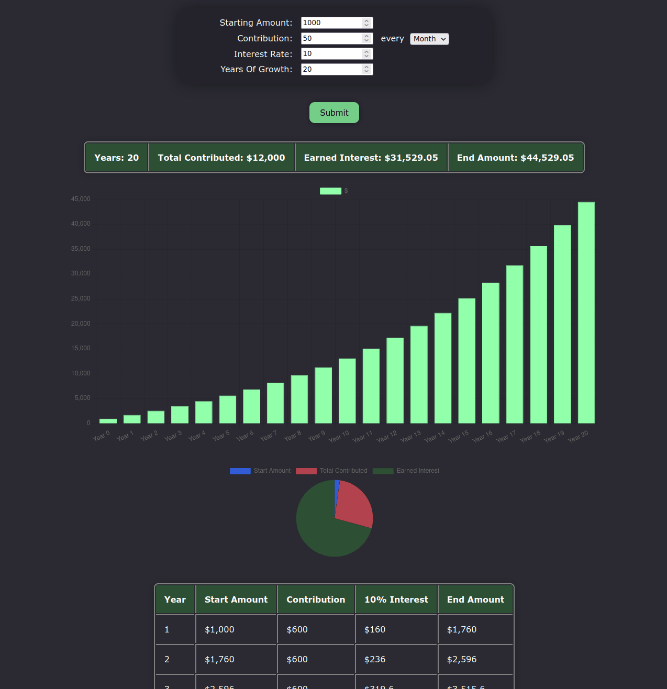

I wanted a investment calculator that didn't restrict me with "you can't put it over 100 years" or "you can't have more than 20% interest per year". This website only resticts you with nonnumbers and less than 0 amounts. This project is a still a work in progress. I hope to finish it within the coming weeks. This was only made so I can put it on my résumé but use it how you wish (within the license agreement obviously). This website uses chart.js.

Website is here (so you don't have to download): https://investment-calculator-rho.vercel.app/

